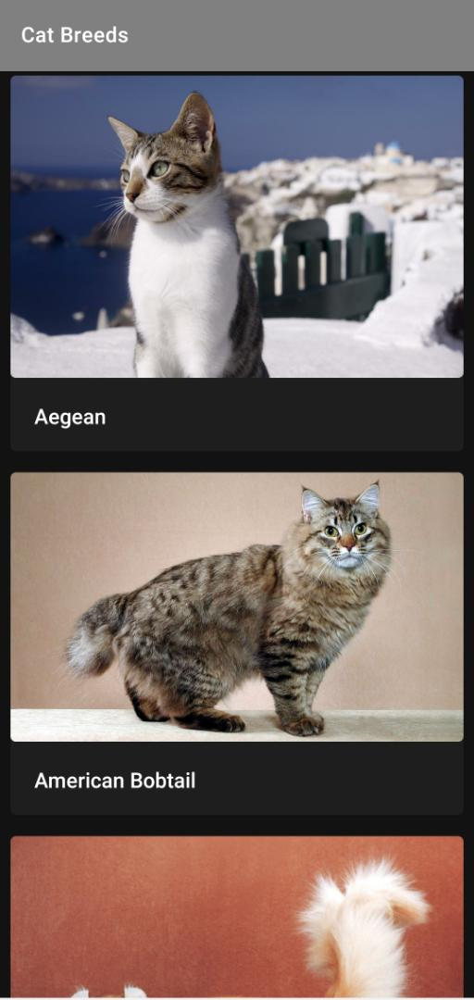
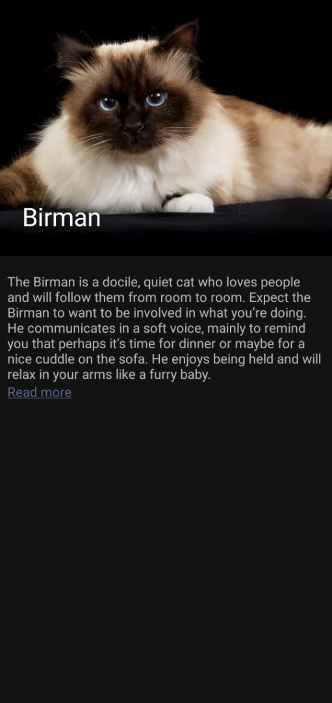

# Cats

This is a single screen Android application in Kotlin that displays a list of Cat Breeds and the images of the Cats.
When a Cat Breed is clicked a Detail page that shows more information on the cat breed is opened.

The app uses the [CatAPI](https://thecatapi.com/) to fetch the different cat breeds

Documentation for the CatAPI can be found [here](https://docs.thecatapi.com/)

#### The app uses the following technologies:
* [MVVM Architecture](https://developer.android.com/jetpack/guide)
* [Android Jetpack](https://developer.android.com/jetpack) Libraries
* [Dagger2](https://dagger.dev/) for Dependency Injection
* [JUnit4](https://junit.org/junit4/) for Testing
* [Mockito](https://site.mockito.org/) for Mocking Test Dependencies
* [Coil](https://coil-kt.github.io/coil/getting_started/) for Image Loading
* [Retrofit](https://square.github.io/retrofit/) for Network Requests

## Screenshot
Here are Screenshots from the app

